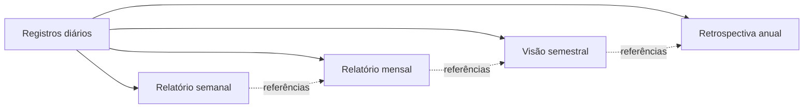
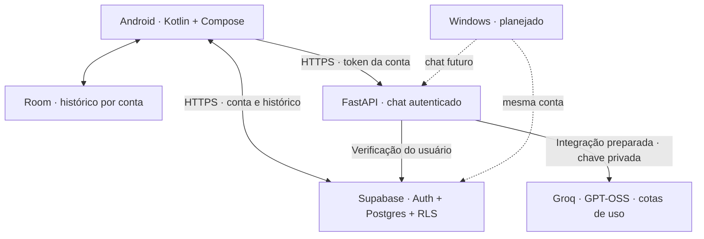

<div align="center">


# KOIWAI

### Uma presença. Uma memória. Uma parceira para o dia a dia.

**Pode chamar de Koi.**


[O que já funciona](#o-que-já-funciona) · [Próximas versões](#próximas-versões) · [Executar](#executar-em-desenvolvimento) · [Documentação](#documentação)

</div>

---

## O projeto

A Koiwai nasceu de uma vontade: ter uma assistente pessoal que acompanhe a vida de verdade, com identidade própria, continuidade entre dispositivos e uma memória que possa ser consultada e corrigida.

O objetivo é conversar com a Koi, organizar o dia e, aos poucos, permitir que ela ajude a executar tarefas com permissões claras. O Android é o primeiro lar; o Windows faz parte da evolução planejada.

**A Koiwai já conversa com IA na nuvem.** O backend está publicado no Render Free, e uma conversa autenticada com contexto fictício passou no Poco. O app usa Groq pela rota HTTPS protegida; a demonstração local mantém saudação e eco.

## Uma identidade que você reconhece

Koi é uma personagem feminina, calma, próxima e competente, com humor leve. O tratamento usado na saudação pode ser personalizado no app.

O visual combina roxo, azul e vermelho sobre superfícies escuras: brilho, contraste e movimento suave. Cada área tem sua própria composição, mantendo a mesma identidade. Os fundos são animados e os botões reagem ao toque. Existe uma opção persistente para reduzir movimento, e as animações também respeitam a configuração do sistema.

A personagem é ilustrada: animação da personagem e voz própria são possibilidades futuras.

## O que já funciona

| Área | Entrega atual |
| :--- | :--- |
| **Home** | Personagem, saudação personalizável, data/hora reais, estado da conta e atalhos. |
| **Chat** | Conversa por texto com Groq via servidor HTTPS, contexto recente limitado, histórico persistente, horários e nova tentativa após falha. |
| **Memória** | Linha do tempo das conversas reais, navegação por dia e busca no histórico. |
| **Rotina** | Painel visual e navegação pelas categorias. Cadastros e execução de tarefas ainda estão em preparação. |
| **Configurações** | Personalização da saudação, redução de movimento e acesso à conta. |
| **Conta** | Cadastro/login por e-mail, confirmação de e-mail, sessão criptografada e sincronização. |
| **Dados** | Banco local por conta, importação explícita do histórico local e reconciliação por UUID na nuvem. |
| **Servidor** | API FastAPI; rota protegida validando a conta no Supabase; demonstração separada, disponível apenas em desenvolvimento. |

O histórico pode ser lido sem conexão. Receber uma resposta exige internet; a instalação testada usa o servidor gratuito na nuvem, sem depender do computador. O serviço pode dormir quando fica sem uso, então a primeira resposta pode demorar. A sincronização tenta novamente quando houver rede. Ela não reenvia automaticamente uma conversa que falhou no servidor.

## O que a Koi poderá fazer

- **Conversar com contexto:** usar um modelo de IA com acesso limitado ao histórico relevante.
- **Construir memória útil:** separar registros diários, fatos confirmados e resumos com referências às conversas originais.
- **Ajudar a organizar a vida:** agenda, tarefas, notas, treinos e finanças com dados estruturados.
- **Falar e ouvir:** começar por um botão de voz, com interrupção da fala; estudar ativação por “Koi” depois.
- **Acompanhar vários dispositivos:** manter uma conta e continuidade entre Android e Windows.
- **Agir com autorização:** executar ações permitidas, conferir resultados e pedir confirmação para operações sensíveis.
- **Ser proativa quando configurada:** oferecer lembretes e relatórios sem depender de manter o computador ligado.

Essas são metas de desenvolvimento, ainda não funcionalidades disponíveis. Custos, limites e permissões serão definidos antes de cada integração.

## Memória ao longo do tempo

A proposta vai além de guardar mensagens:



Os relatórios deverão indicar o período realmente coberto e permitir voltar às fontes. Quando o uso começar no meio do ano, a primeira retrospectiva anual reunirá apenas os registros existentes até dezembro. Não será necessário esperar seis meses, e a Koi não deverá inventar acontecimentos de períodos sem dados.

**Hoje existe o histórico diário consultável. A geração e a entrega automática desses relatórios estão no roadmap.**

## Próximas versões

As versões representam etapas verificáveis, sem datas prometidas. A `v0.0.1` identifica a especificação inicial; a `v0.1.0` é o primeiro marco funcional em andamento. O `versionName` do template Android ainda não representa uma release pública.

| Marco | Objetivo | Situação |
| :--- | :--- | :--- |
| `v0.0.1` · Fundação | Especificação, identidade e arquitetura inicial. | Base definida |
| `v0.1.0` · Nascimento | Chat com IA, conta, histórico e backend HTTPS sem depender do PC. | **Em andamento** |
| `v0.2.0` · Continuidade | Cliente Windows e mesma conta entre dispositivos. | Planejado |
| `v0.3.0` · Memória | Diário, fatos confirmados, fontes e relatórios por período. | Planejado |
| `v0.4.0` · Voz | Ouvir, transcrever, responder falando e interromper. | Planejado |
| `v0.5.0` · Organização | Agenda, tarefas, notas, treinos e finanças funcionais. | Planejado |
| `v0.6.0` · Proatividade | Lembretes e entrega programada de relatórios. | Planejado |
| `v0.7.0` · Presença no PC | Agente Windows com permissões e ações limitadas. | Planejado |
| `v0.8.0` · Ações verificáveis | Interação com a tela, conferência de resultados e parada segura. | Planejado |
| `v0.9.0` · Ações no celular | Integrações Android selecionadas e permissões visíveis. | Planejado |
| `v0.10.0` · Resiliência | Ampliar o funcionamento offline e tratar conflitos de sincronização. | Planejado |
| `v1.0.0` · Uso diário confiável | Validar uma semana de uso essencial sem perda de dados ou exceder o orçamento. | Meta |

### Para concluir a primeira versão

- [x] Definir a identidade e refinar as cinco áreas do app.
- [x] Persistir conversas no celular e preservar dados nas atualizações.
- [x] Implementar conta e sincronização com Supabase.
- [x] Preparar autenticação do backend e separar a demonstração local.
- [ ] Publicar o backend em HTTPS e validar a conversa autenticada em produção.
- [ ] Integrar IA com limites de uso e controle de custos.
- [ ] Ajustar o retorno da confirmação de e-mail para o app.
- [ ] Validar o fluxo completo com o computador desligado.

O plano detalhado e os critérios de conclusão estão em [ROADMAP.md](docs/ROADMAP.md).

## Arquitetura



Em desenvolvimento, o Android também pode usar o simulador HTTP local. Esse caminho não recebe tokens da conta e é desabilitado no backend em produção. A autenticação preparada não significa que a hospedagem já esteja concluída.

### Privacidade e controle

- O Supabase utiliza políticas de acesso por dono da conversa.
- Cada conta tem um banco local separado; importar conversas locais exige uma ação explícita.
- Tokens ficam criptografados com Android Keystore e fora do backup automático.
- Credenciais administrativas, senhas e conversas pessoais não pertencem ao repositório.
- O backend valida a identidade; um `user_id` enviado pelo cliente não determina o usuário.
- O app usa HTTPS para autenticação e não segue redirecionamentos ao enviar tokens.

Há um aviso de permissões pendente no projeto Supabase, descrito em [SUPABASE.md](docs/SUPABASE.md). Esta versão ainda não é apresentada como uma implantação de produção pronta.

## Executar em desenvolvimento

Pré-requisitos: Python com suporte às versões de [requirements.txt](requirements.txt), Android Studio com o SDK usado pelo projeto e um aparelho Android 8 ou superior, ou emulador. A validação local atual usou Python 3.14 e um aparelho Android físico.

### 1. Servidor de demonstração

No PowerShell, dentro da pasta do repositório:

```powershell
python -m venv .venv
.\.venv\Scripts\python.exe -m pip install -r requirements.txt
Copy-Item .env.example .env
.\.venv\Scripts\python.exe -m uvicorn backend.app.main:app --host 0.0.0.0 --port 8000
```

A demonstração funciona com `ENVIRONMENT=development` e não precisa de credenciais válidas. Para testar a rota protegida, configure o projeto Supabase em `.env` e use HTTPS. A documentação interativa local fica em `http://localhost:8000/docs`.

Para respostas de IA, configure `GROQ_API_KEY` somente no `.env` do servidor.
A integração Groq e o contexto recente foram implementados e testados localmente,
inclusive com chamadas reais usando dados fictícios. A hospedagem HTTPS e a
validação no aparelho ainda estão pendentes. O simulador HTTP
continua com respostas demonstrativas. Detalhes em [IA_GROQ.md](docs/IA_GROQ.md).

### 2. Aplicativo Android

Copie `android/koiwai.local.properties.example` para `android/koiwai.local.properties` e configure o endereço do servidor, a origem do seu Supabase e sua chave publishable. Esse arquivo pessoal é ignorado pelo Git. As configurações de SDK ficam em `android/local.properties`, gerenciado pelo Android Studio.

Abra a pasta `android/` no Android Studio, sincronize o projeto e execute no dispositivo. Você também pode sobrescrever o endereço do backend diretamente na compilação:

```powershell
cd android
.\gradlew.bat assembleDebug -PkoiBackendUrl=http://IP_DO_SEU_PC:8000
```

No aparelho físico, use o IP do computador acessível pela mesma rede. No emulador padrão Android, use `http://10.0.2.2:8000`. O fallback de debug aponta para o emulador; configure o IP do seu PC no arquivo local antes de executar em um aparelho físico.

Para hospedagem, passe uma origem `https://...`. O app seleciona a rota protegida e exige login. Builds de release bloqueiam HTTP e precisam de um endereço configurado. Nunca coloque tokens ou senhas nessa propriedade.

Configure seu próprio projeto Supabase no arquivo local e revise o SQL em [docs/sql](docs/sql) antes de aplicá-lo ao seu projeto. A origem e a chave **publishable** devem corresponder ao backend. As propriedades Gradle `koiSupabaseUrl` e `koiSupabasePublishableKey` também podem ser usadas na compilação.

### 3. Verificações

```powershell
# Na raiz:
.\.venv\Scripts\python.exe -m unittest discover -s backend/tests -v

# Na pasta android:
.\gradlew.bat testDebugUnitTest lintDebug
```

Os testes de interface e persistência em `androidTest/` precisam de um dispositivo ou emulador. Há cobertura de migração do banco, recuperação de envios interrompidos, reconciliação, navegação, busca, rascunho e preferência de movimento. As verificações do backend cobrem autenticação, falhas do serviço e isolamento da demonstração.

## Documentação

| Documento | Conteúdo |
| :--- | :--- |
| [Roadmap](docs/ROADMAP.md) | Etapas, metas e critérios de conclusão. |
| [Estado atual](docs/ESTADO_ATUAL.md) | Registro das entregas e validações. |
| [Backend e autenticação](docs/BACKEND.md) | Rotas, configuração, HTTPS e testes. |
| [Conta e sincronização](docs/SUPABASE.md) | Persistência, sessões, políticas e limitações. |
| [Navegação](docs/ENTREGA_NAVEGACAO.md) | Estrutura das telas e comportamento. |
| [Refinamento visual](docs/REFINAMENTO_VISUAL.md) | Direção visual, movimento e validação no celular. |

---

<div align="center">

**Koiwai está sendo construída para acompanhar o cotidiano, uma etapa bem feita de cada vez.**

Roxo para a identidade. Azul para a conexão. Vermelho para a energia.

</div>
