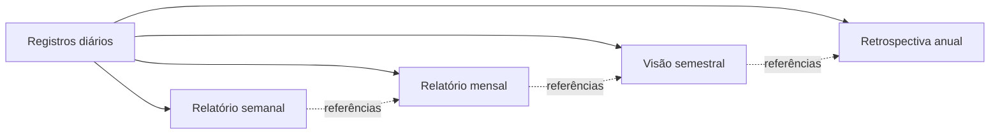
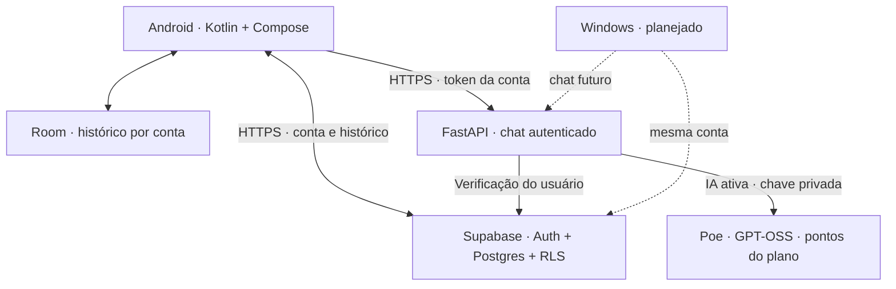

# Novidades da V1.7 — expansão funcional

Contexto de registros recentes na conversa, busca flexível com fontes, cópias de
consultas para falhas de conexão, limite diário de preparo automático, ajustes das
vozes instaladas, integração ao gesto de assistente e consulta da agenda sincronizada
no Android. **Preparada, instalação e validação física pendentes.** Gmail/Tasks/Drive
OAuth e bancos ainda não conectados. [Entrega e dependências](docs/ENTREGA_EXPANSAO_V1_7.md).

# Novidades da V1.6 — Meu ritmo com a Koi

Check-ins com início e fim, revisão do dia, constância dos hábitos e sugestões
aplicáveis de reagendamento com Desfazer. Acompanhamento opcional com tipos,
horários, frequência e silêncio configuráveis. Botões e avisos não geram IA;
entrega local depende do Android e internet. [Entrega e estado](docs/ENTREGA_COMPANHEIRA_V1_6.md).

# Novidades da V1.5

Busca de lembranças por palavras e período, com trechos originais; plano do dia que
preserva horários e sugere prioridades; receitas/despesas e orçamentos por categoria.
Configurações inclui um laboratório com 12 exemplos Teste, sem duplicação ao repetir.
Os botões consultam dados sem gerar IA; consultas no chat podem usar interpretação.
[Entrega e limites](docs/ENTREGA_ORGANIZACAO_V1_5.md).

# Novidades da V1.4

Meu dia reúne missões com horário, contas próximas, dinheiro registrado e diário.
Configurações mostram o saldo do Poe; consultas naturais recuperam lembranças,
diário anterior e comparam períodos. Cartões sem geração de IA; chat interpreta
antes da consulta. [Entrega, testes e limites](docs/ENTREGA_MEUDIA_V1_4_2026_10_08.md).

## Entrega anterior: V1.3

Contas recorrentes, registro de pagamento com despesa e desfazer, orçamento mensal,
diário por dia/categoria, cálculo de sono informado e balanço semanal. Acompanhamento
opcional no Android respeita o descanso e limita avisos a um por dia. Dados por conta,
sem conexão bancária automática. Render e Supabase gratuitos; usuário contratou Poe.
[Entrega e limites reais](docs/ENTREGA_VIDA_V1_3_2026_10_08.md).

> **V1.2 contextual instalada no Poco (08/10/2026):** interpretação por IA, memória corrigida, relatos opcionais, cartões de ações Android e microfone dentro da Koi. [Entrega, verificação e limites](docs/ENTREGA_CONTEXTUAL_V1_2_2026_10_08.md).

> **Entrega anterior: V1.1 instalada no Poco (08/10/2026).** Configurações e ferramentas reorganizadas; painel interativo com testes guiados, limites e próximos módulos. [Entrega e verificações](docs/ENTREGA_V1_1_2026_10_08.md) · [Painel ilustrativo](docs/dashboard/index.html).

<div align="center">


# KOIWAI

### Uma presença. Uma memória. Uma parceira para o dia a dia.

**Pode chamar de Koi.**


[O que já funciona](#o-que-já-funciona) · [Próximas versões](#próximas-versões) · [Executar](#executar-em-desenvolvimento) · [Documentação](#documentação)

</div>

---

Para retomar o desenvolvimento, leia o [resumo de continuidade](docs/CONTINUIDADE_KOIWAI.md).

**Revisão funcional V1.1:** 79 testes de servidor e 25 testes unitários Android
aprovados. Correções de comandos negados, comparações financeiras e entrada de
valores; APK preparado, aguardando celular. [Relatório e próximos pacotes](docs/REVISAO_FUNCIONAL_2026_10_08.md).
A prioridade é acompanhar a vida por conversa; reorganização visual vem depois.

**Pacote móvel V1.0 instalado:** novas áreas, voz, imagens, pesquisa e botões do celular. Sete testes de dados passaram no Poco; conferência visual e novas conexões continuam pendentes. [Atualização e limites](docs/ATUALIZACAO_CELULAR_2026_10_08.md) · [Dashboard ilustrativo — baixe e abra no navegador](docs/dashboard/index.html). Os atalhos Google/ChatGPT abrem serviços, ainda não conectam os dados das contas.

## O projeto

A Koiwai nasceu de uma vontade: ter uma assistente pessoal que acompanhe a vida de verdade, com identidade própria, continuidade entre dispositivos e uma memória que possa ser consultada e corrigida.

O objetivo é conversar com a Koi, organizar o dia e, aos poucos, permitir que ela ajude a executar tarefas com permissões claras. O Android é o primeiro lar; o Windows faz parte da evolução planejada.

**A Koiwai já conversa com IA na nuvem.** O backend usa Render Free e rota HTTPS protegida. A migração para Poe usa GPT-OSS-120B no texto, validação de respostas no servidor e consultas simples com uma chamada. Plano mensal do usuário: 10.000 pontos/dia. Imagem/pesquisa na nova integração ainda exigem testes reais. [Integração, consumo e limites](docs/IA_POE.md). A demonstração local mantém saudação e eco.

## Uma identidade que você reconhece

Koi é uma personagem feminina, próxima e competente, com um jeito alegre, carinhoso e brincalhão. Ela adapta o tom ao assunto e evita explicações técnicas sem necessidade. O tratamento usado na saudação pode ser personalizado no app.

O visual combina roxo, azul e vermelho sobre superfícies escuras: brilho, contraste e movimento suave. Cada área tem sua própria composição, mantendo a mesma identidade. Os fundos são animados e os botões reagem ao toque. Existe uma opção persistente para reduzir movimento, e as animações também respeitam a configuração do sistema.

A personagem é ilustrada: animação da personagem e voz própria são possibilidades futuras.

## O que já funciona

| Área | Entrega atual |
| :--- | :--- |
| **Home** | Personagem, saudação personalizável, data/hora reais, estado da conta, contagem de tarefas e atalhos. |
| **Chat** | Conversa com Poe via HTTPS; contexto recente, lembranças e tarefas atuais. V1.0 acrescenta registros pessoais, ditado, leitura em voz, imagens escolhidas e pesquisa explícita na internet com fontes. Novo APK do Pack 2 executa pedidos claros de criar, concluir, editar, reabrir, arquivar e desfazer, sem revisão repetida. |
| **Memória** | Diário por dia e busca; lembranças confirmadas; sugestões revisáveis e resumos diários. Pack 2 acrescenta semana, mês, semestre e ano com fontes e preparação opcional pelo Android. |
| **Rotina** | Tarefas reais na conta: criar, editar, concluir, reabrir e apagar; data, horário, repetição e últimas conquistas. V1.0 acrescenta agenda e hábitos como vistas das tarefas, notas, listas, metas, registros de treino e finanças BRL; consulta e edição na conta, arquivos recuperáveis e desfazer. |
| **Configurações** | Personalização da saudação, redução de movimento, leitura opcional das novas respostas e acesso à conta. |
| **Ferramentas V1.0** | Calculadora local, clima por cidade, busca no navegador, timer de foco, TXT e compartilhamento; formulário no calendário instalado. |
| **Conta** | Cadastro/login por e-mail, confirmação de e-mail, sessão criptografada e sincronização. |
| **Dados** | Banco local por conta, importação explícita do histórico local e reconciliação por UUID na nuvem. |
| **Servidor** | API FastAPI; rota protegida validando a conta no Supabase; demonstração separada, disponível apenas em desenvolvimento. |

O histórico pode ser lido sem conexão. Receber uma resposta exige internet; a instalação testada usa o servidor gratuito na nuvem, sem depender do computador. O serviço pode dormir quando fica sem uso, então a primeira resposta pode demorar. A sincronização tenta novamente quando houver rede. Ela não reenvia automaticamente uma conversa que falhou no servidor.

No novo APK, experimente “Quais são minhas tarefas de hoje?”, “Adicione estudar amanhã às 9h” ou “Já terminei estudar”. Um pedido claro realiza uma ação; alvos ambíguos pedem esclarecimento. O resultado aparece depois da confirmação na nuvem e pode ser desfeito. Aplicativos antigos continuam usando propostas revisáveis. A consulta envia até 60 tarefas ao provedor de IA e informa quando a lista está incompleta. [Detalhes do Pack 2](docs/PACK_2.md).

## O que a Koi poderá fazer

- **Ampliar o contexto:** melhorar a seleção de informações relevantes além da conversa recente já disponível.
- **Construir memória útil:** separar registros diários, fatos confirmados e resumos com referências às conversas originais.
- **Ampliar a organização:** prioridades/subtarefas, calendário integrado, offline para registros pessoais e busca de notas longas.
- **Ampliar a voz:** validar o botão de ditado/leitura da V1.0 no aparelho; estudar ativação por “Koi” depois.
- **Acompanhar vários dispositivos:** manter uma conta e continuidade entre Android e Windows.
- **Agir com autorização:** executar ações permitidas, conferir resultados e pedir confirmação para operações sensíveis.
- **Ser proativa quando configurada:** oferecer lembretes e relatórios sem depender de manter o computador ligado.

Essas são metas de desenvolvimento, ainda não funcionalidades disponíveis. Custos, limites e permissões serão definidos antes de cada integração.

## Memória ao longo do tempo

A proposta vai além de guardar mensagens:



Os relatórios deverão indicar o período realmente coberto e permitir voltar às fontes. Quando o uso começar no meio do ano, a primeira retrospectiva anual reunirá apenas os registros existentes até dezembro. Não será necessário esperar seis meses, e a Koi não deverá inventar acontecimentos de períodos sem dados.

**O Pack 2 implementa relatórios por período e entrega opcional no app.** O novo APK foi instalado no Poco e passou nos cinco testes de persistência; ações e relatórios ainda aguardam validação funcional. Fontes dos relatórios maiores levam aos capítulos mensais e diários; cobertura parcial é indicada. Confira limites e evidências em [PACK_2.md](docs/PACK_2.md).

### Desenvolvimento em packs

A prioridade atual é completar o celular antes de criar o cliente Windows.

| Pack | Entrega |
| --- | --- |
| 1 | Sugestões de lembranças com revisão, resumo diário com fontes e tarefas reais. Implementado; confira as evidências em [PACK_1.md](docs/PACK_1.md). |
| 2 | Ações de tarefas pelo chat, desfazer, lembretes e relatórios por período. Instalado; persistência aprovada, validação funcional pendente. [Evidências](docs/PACK_2.md). |
| 3 | Voz por botão, interrupção da fala e refinamento de personalidade. |
| 4 | Notas, agenda, objetivos, treinos, finanças e ações verificáveis dentro do app. |
| 5 | Offline ampliado, privacidade, recuperação de conta, acabamento e uso prolongado. |

Tarefas e relatórios do Pack 1 exigem internet. Lembretes locais com descanso,
adiamento e conclusão implementados e com teste inicial aprovado no Poco.
Reinício, toque real nas ações e confiabilidade prolongada ainda precisam de validação.
São opcionais, exigem permissão e data/horário e podem atrasar pelo Android.
Nenhuma sugestão vira lembrança sem confirmação. Resumos de IA devem
ser conferidos nas fontes; só cobrem as mensagens sincronizadas da pessoa.

Confira o estado de publicação, testes e próximos passos em
[Revisão final do checkpoint](docs/REVISAO_FINAL_2026_10_07.md).

## Próximas versões

As versões representam etapas verificáveis, sem datas prometidas. A `v0.0.1` identifica a especificação inicial; a `v0.1.0` é o primeiro marco funcional em andamento. O `versionName` do template Android ainda não representa uma release pública.

| Marco | Objetivo | Situação |
| :--- | :--- | :--- |
| `v0.0.1` · Fundação | Especificação, identidade e arquitetura inicial. | Base definida |
| `v0.1.0` · Nascimento | Chat com IA, conta, histórico e backend HTTPS sem depender do PC. | **Em andamento** |
| `v0.2.0` · Continuidade | Cliente Windows e mesma conta entre dispositivos. | Planejado |
| `v0.3.0` · Memória | Diário, fatos confirmados, fontes e relatórios por período. | Planejado |
| `v0.4.0` · Voz | Ouvir, transcrever, responder falando e interromper. | Planejado |
| `v0.5.0` · Organização | Agenda, tarefas, notas, treinos e finanças funcionais. | Planejado |
| `v0.6.0` · Proatividade | Lembretes e entrega programada de relatórios. | Planejado |
| `v0.7.0` · Presença no PC | Agente Windows com permissões e ações limitadas. | Planejado |
| `v0.8.0` · Ações verificáveis | Interação com a tela, conferência de resultados e parada segura. | Planejado |
| `v0.9.0` · Ações no celular | Integrações Android selecionadas e permissões visíveis. | Planejado |
| `v0.10.0` · Resiliência | Ampliar o funcionamento offline e tratar conflitos de sincronização. | Planejado |
| `v1.0.0` · Uso diário confiável | Validar uma semana de uso essencial sem perda de dados ou exceder o orçamento. | Meta |

### Para concluir a primeira versão

- [x] Definir a identidade e refinar as cinco áreas do app.
- [x] Persistir conversas no celular e preservar dados nas atualizações.
- [x] Implementar conta e sincronização com Supabase.
- [x] Preparar autenticação do backend e separar a demonstração local.
- [x] Publicar o backend em HTTPS e validar a conversa autenticada em produção.
- [ ] Integrar IA com limites de uso e controle de custos.
- [ ] Ajustar o retorno da confirmação de e-mail para o app.
- [ ] Validar o fluxo completo com o computador desligado.

O plano detalhado e os critérios de conclusão estão em [ROADMAP.md](docs/ROADMAP.md).

## Arquitetura



Em desenvolvimento, o Android também pode usar o simulador HTTP local. Esse caminho não recebe tokens da conta e é desabilitado no backend em produção. A instalação testada usa o backend HTTPS no Render Free.

### Privacidade e controle

- O Supabase utiliza políticas de acesso por dono da conversa.
- Cada conta tem um banco local separado; importar conversas locais exige uma ação explícita.
- Tokens ficam criptografados com Android Keystore e fora do backup automático.
- Credenciais administrativas, senhas e conversas pessoais não pertencem ao repositório.
- O backend valida a identidade; um `user_id` enviado pelo cliente não determina o usuário.
- O app usa HTTPS para autenticação e não segue redirecionamentos ao enviar tokens.

As permissões da função de inicialização RLS foram corrigidas; o aviso existente de proteção contra senhas vazadas está registrado em [SUPABASE.md](docs/SUPABASE.md). O projeto permanece em desenvolvimento.

## Executar em desenvolvimento

Pré-requisitos: Python com suporte às versões de [requirements.txt](requirements.txt), Android Studio com o SDK usado pelo projeto e um aparelho Android 8 ou superior, ou emulador. A validação local atual usou Python 3.14 e um aparelho Android físico.

### 1. Servidor de demonstração

No PowerShell, dentro da pasta do repositório:

```powershell
python -m venv .venv
.\.venv\Scripts\python.exe -m pip install -r requirements.txt
Copy-Item .env.example .env
.\.venv\Scripts\python.exe -m uvicorn backend.app.main:app --host 0.0.0.0 --port 8000
```

A demonstração funciona com `ENVIRONMENT=development` e não precisa de credenciais válidas. Para testar a rota protegida, configure o projeto Supabase em `.env` e use HTTPS. A documentação interativa local fica em `http://localhost:8000/docs`.

Para Poe, configure `AI_PROVIDER=poe` e `POE_API_KEY` somente no `.env` privado
ou nos segredos do servidor. Veja [IA_POE.md](docs/IA_POE.md). Esse modo não usa Groq.
Groq permanece disponível no código com `AI_PROVIDER=groq`, para reversão explícita.
O incremento de lembranças confirmadas foi instalado e testado no Poco. O simulador HTTP continua com respostas demonstrativas.
Detalhes em [IA_GROQ.md](docs/IA_GROQ.md) e [MEMORIA_CONFIRMADA.md](docs/MEMORIA_CONFIRMADA.md).

### 2. Aplicativo Android

Copie `android/koiwai.local.properties.example` para `android/koiwai.local.properties` e configure o endereço do servidor, a origem do seu Supabase e sua chave publishable. Esse arquivo pessoal é ignorado pelo Git. As configurações de SDK ficam em `android/local.properties`, gerenciado pelo Android Studio.

Abra a pasta `android/` no Android Studio, sincronize o projeto e execute no dispositivo. Você também pode sobrescrever o endereço do backend diretamente na compilação:

```powershell
cd android
.\gradlew.bat assembleDebug -PkoiBackendUrl=http://IP_DO_SEU_PC:8000
```

No aparelho físico, use o IP do computador acessível pela mesma rede. No emulador padrão Android, use `http://10.0.2.2:8000`. O fallback de debug aponta para o emulador; configure o IP do seu PC no arquivo local antes de executar em um aparelho físico.

Para hospedagem, passe uma origem `https://...`. O app seleciona a rota protegida e exige login. Builds de release bloqueiam HTTP e precisam de um endereço configurado. Nunca coloque tokens ou senhas nessa propriedade.

Configure seu próprio projeto Supabase no arquivo local e revise o SQL em [docs/sql](docs/sql) antes de aplicá-lo ao seu projeto. A origem e a chave **publishable** devem corresponder ao backend. As propriedades Gradle `koiSupabaseUrl` e `koiSupabasePublishableKey` também podem ser usadas na compilação.

### 3. Verificações

```powershell
# Na raiz:
.\.venv\Scripts\python.exe -m unittest discover -s backend/tests -v

# Na pasta android:
.\gradlew.bat testDebugUnitTest lintDebug
```

Os testes de interface e persistência em `androidTest/` precisam de um dispositivo ou emulador. Há cobertura de migração do banco, recuperação de envios interrompidos, reconciliação, navegação, busca, rascunho e preferência de movimento. As verificações do backend cobrem autenticação, falhas do serviço e isolamento da demonstração.

## Documentação

| Documento | Conteúdo |
| :--- | :--- |
| [Roadmap](docs/ROADMAP.md) | Etapas, metas e critérios de conclusão. |
| [Estado atual](docs/ESTADO_ATUAL.md) | Registro das entregas e validações. |
| [Backend e autenticação](docs/BACKEND.md) | Rotas, configuração, HTTPS e testes. |
| [Conta e sincronização](docs/SUPABASE.md) | Persistência, sessões, políticas e limitações. |
| [Navegação](docs/ENTREGA_NAVEGACAO.md) | Estrutura das telas e comportamento. |
| [Refinamento visual](docs/REFINAMENTO_VISUAL.md) | Direção visual, movimento e validação no celular. |

---

<div align="center">

**Koiwai está sendo construída para acompanhar o cotidiano, uma etapa bem feita de cada vez.**

Roxo para a identidade. Azul para a conexão. Vermelho para a energia.

</div>
